<h1 align="center">  
    
  <br>  
</h1>  

<p align="center">  
    <a href="https://opensource.org/licenses/MIT"></a>  
    <a href="https://github.com/EasyRecon/Hunt3r/issues"></a>  
    <a href="https://github.com/EasyRecon/Hunt3r"></a>
    <a href="https://github.com/easyrecon/hunt3r/issues" target="_blank"></a>
</p>

<p align="center">  
    <a href="https://codeclimate.com/github/EasyRecon/Hunt3r"></a>
    <a href="https://github.com/easyrecon/hunt3r/actions/workflows/codeql-analysis.yml"></a>
</p>

<p align="center">
  <a href="#installation-instructions">Quick Installation</a> •
  <a href="#preview">Preview</a> •
  <a href="https://docs.hunt3r.ovh">Documentation</a>
</p>

# Quick Installation Instructions

```docker
docker-compose up --build
docker-compose run backend rake db:create
docker-compose run backend rake db:migrate
docker-compose run backend rake db:seed
```

Once the Docker environment is up, you can access the application through the Web UI available on [http://0.0.0.0](http://0.0.0.0) with the following default credentials :
- Email address : `admin@admin.tld`
- Password : `password`

# Preview

| Light Dashboard | Dark Dashboard |
:---:|:---:
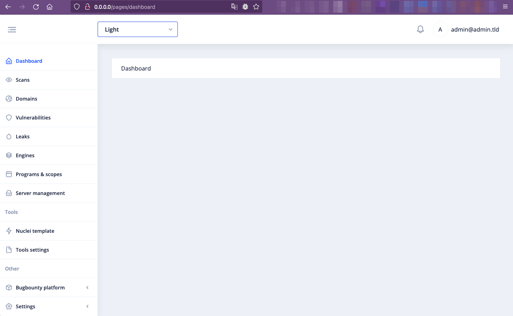 | 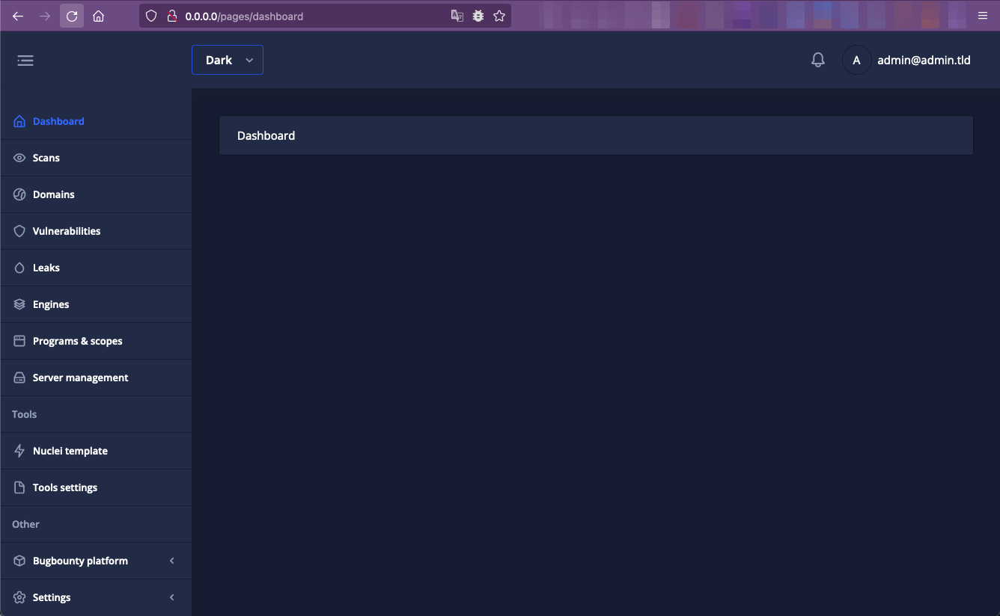
| Platform statistics | Tools Settings |
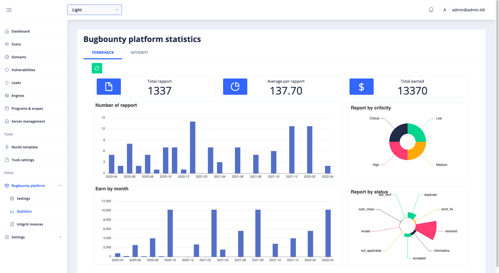 | 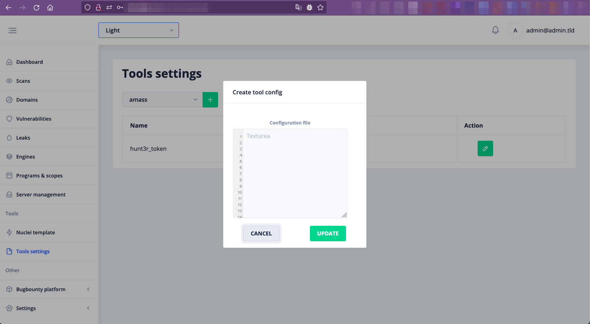
| Meshs management | Domains pages |
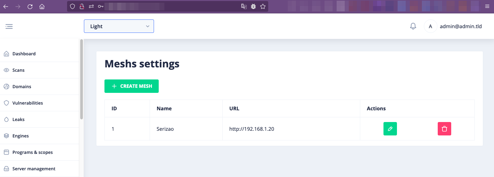 | 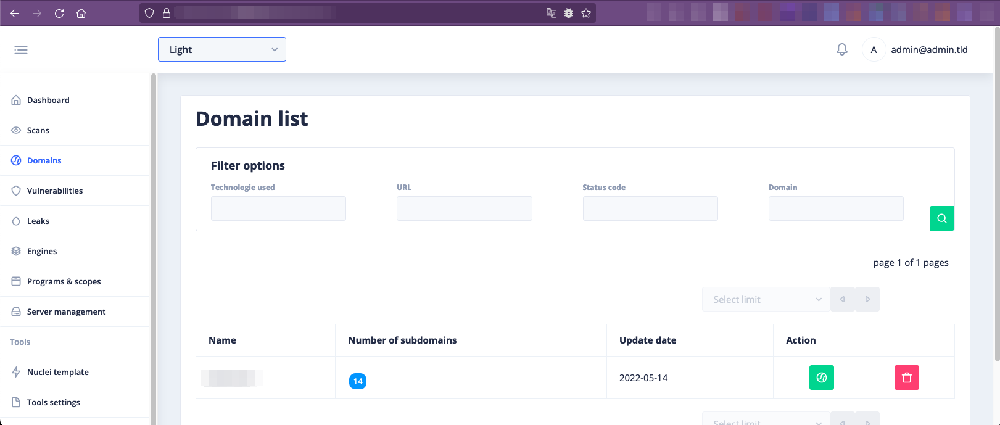
| Scans | Vulnerabilities |
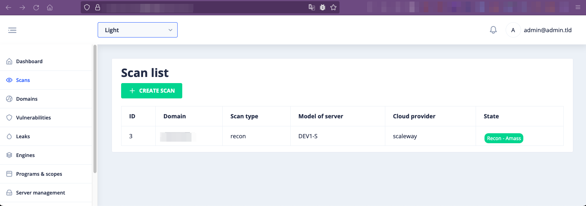 | 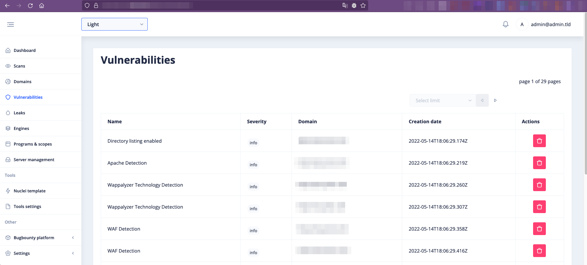
| Programs | Scopes |
 | 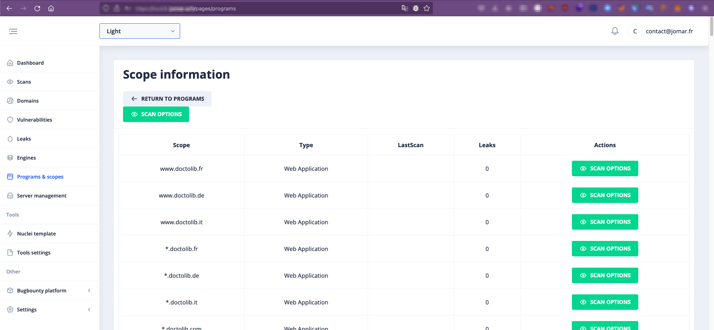
| Subdomains | Leaks |
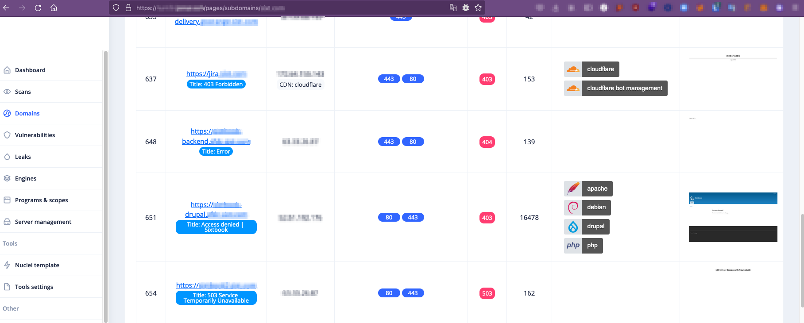 | 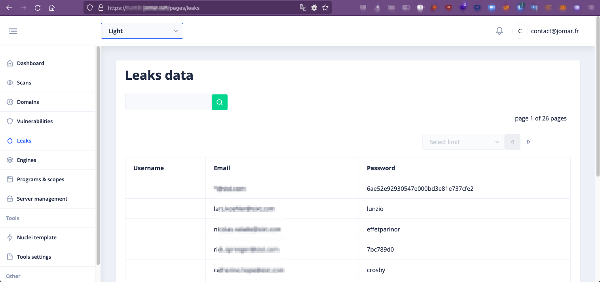
| Engines | Launch scan |
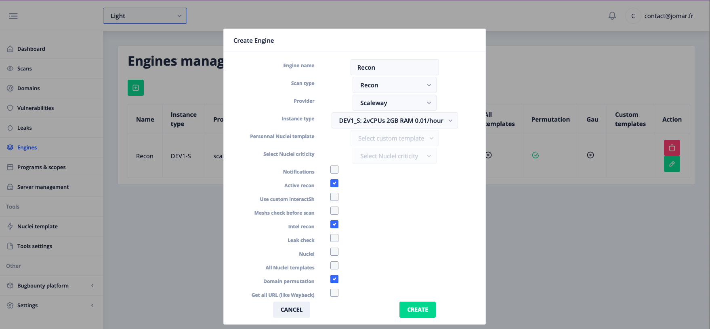 | 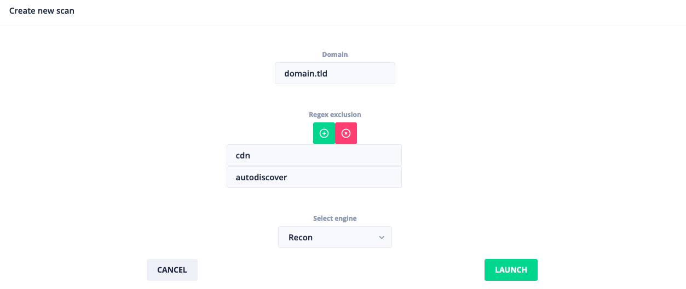