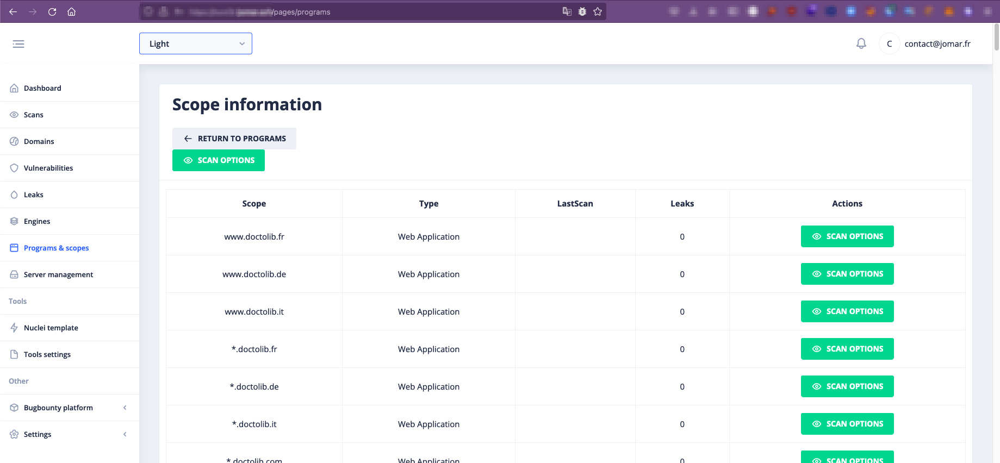

# Programs & Scopes Synchronisation

Hunt3r allows you to synchronize your programs & scopes from YesWeHack, Intigriti and Hackerone platforms, this feature allows you to directly launch a scan on a scope or a set of scopes.

Before being stored, scopes are normalized.

  - Only web assets are present
  - `domain.(fr|com|tld)` will be standardized into 3 distinct areas

