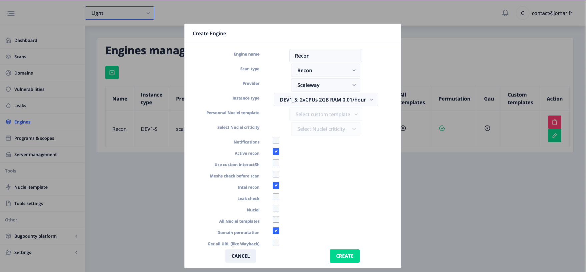

# Engines management

Before launching a scan it will be necessary to configure an Engine.  
The use of engines allows to keep predefined parameters and to simplify the launching of scans on several targets with the same parameters.

The most important parameter that needs to be thought through beforehand here is the instance type you want to use. The more powerful the instance the more expensive it will be. However,

  - A more powerful instance will speed up some steps
    - Some steps being executed with concurrency, the more powerful the instance, the higher the number of threads will be used
  - If your target has more than 20 000 domains we recommend to use at least a DEV1-M instance