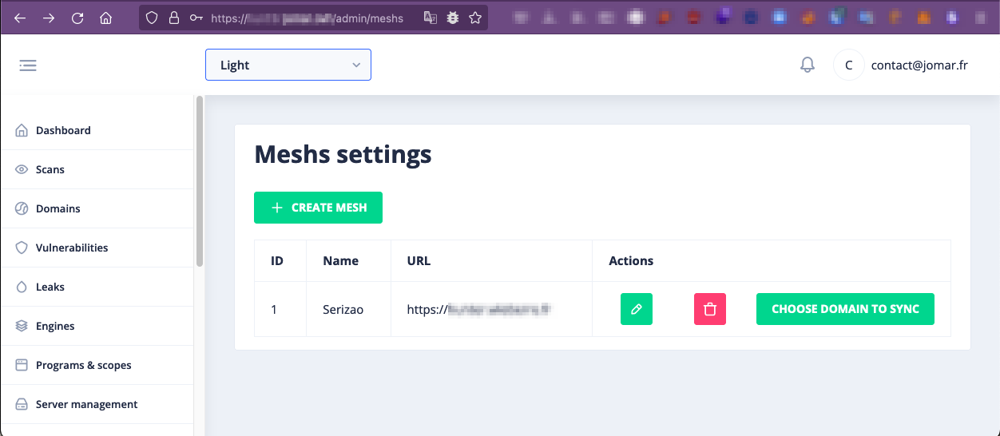
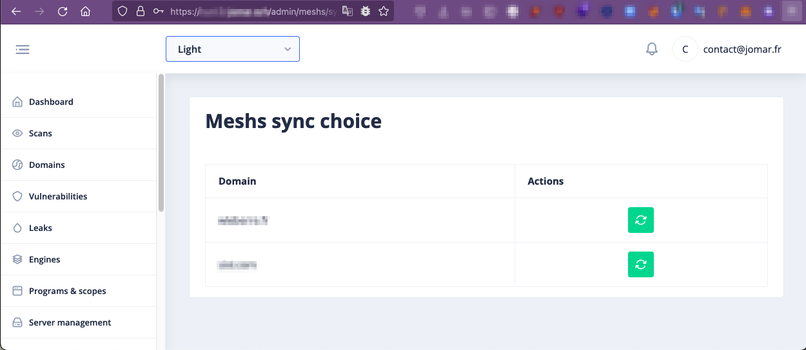

# Meshs management

In Hunt3r we have implemented a mesh system that allows you to query a friend's Hunt3r instance to retrieve the 
subdomains they already have in their instance.

## Configure a mesh

In [/admin/meshs](http://0.0.0.0/admin/meshs) you will only need to create a new mesh with the following information:

- The name of the mesh (arbitrary)
- The URL of your friend's Hunt3r instance
- A strong token


On his side, your friend will also have to define a mesh instance with your URL and the same token.

Example :

  - I define the instance with the name `Serizao` and the URL `https://hunt3r.serizao.tld` and the token `SUPER_STRONG`
  - On his side, the friend defines the instance `Jomar` with the URL `https://hunt3r.jomar.tld` and also the token `SUPER_STRONG`

So during the scan, if the mesh option is selected, a request with the following format will be sent :

```json
POST /api/domains/mesh
Host: hunt3r.serizao.tld
...

{ 
  "url": "https://hunt3r.jomar.tld",
  "token": "SUPER_STRONG",
  "domain": "domain.tld"
}
```

At this moment, the friendly instance will check that a mesh is defined with your URL and the token.  
And if so, will return the requested subdomains

## Direct synchronisation

It is also possible to make a direct synchronization of domains without launching a new scan



In the mesh settings, just click on "choose domains" to sync to display the list of domains available on the selected instance and then click on the sync button

