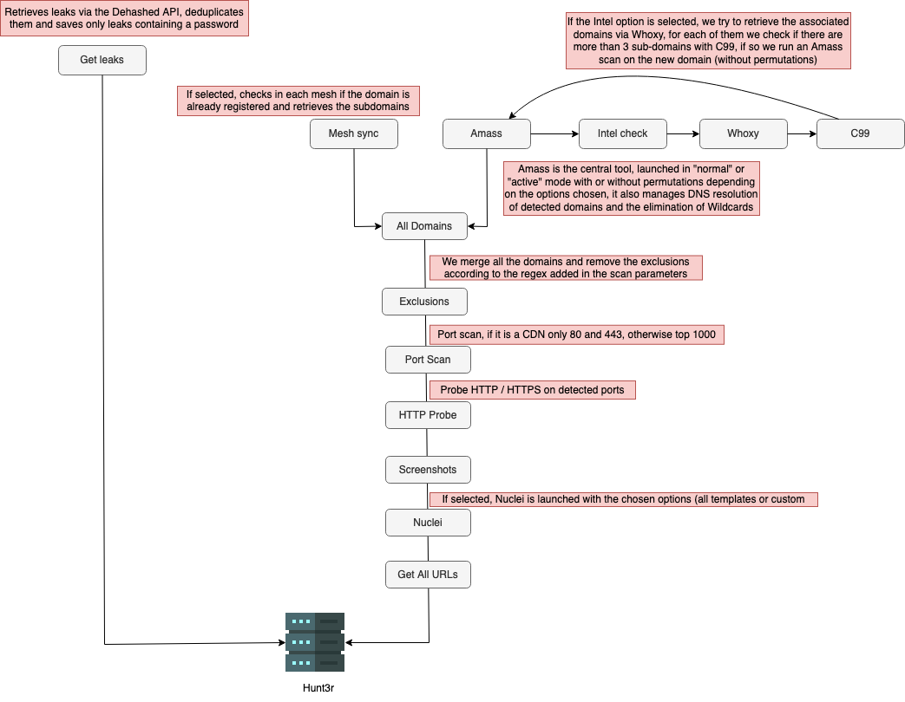

# Recon Scans

Hunt3r allows you to perform recognition scans trying to get the best quality results possible.

It will first be necessary to create an [engine](../engines.md) with the scan type set to 'recon'.

You just have to launch a scan, either directly via the scope of a program or from the 'Scan' tab, at this moment you just have to select the engine configured previously, you can also indicate patterns of exclusions for the subdomains that you do not want scanned / reassembled in your instance Hunt3r

!!! info "Scan exclusion"

    Just indicate the desired pattern to exclude. If you indicate `cdn`, the following regex will be created : `.*cdn.*` thus excluding all domains containing this pattern.

The following specific tools are used during a recon scan :

  - [Dehashed](https://dehashed.com/) : Queries the Dehashed API to retrieve known leaks associated with the domain
      - A filtering step is performed to save only the records that contain a password
  - [Amass](https://github.com/OWASP/Amass) : Is not presented anymore, well used it is simply the best or moreover it is able to do a lot of things
    - It is possible to launch it in active mode with the generation of permutations (with subdomains list from [Six2dez](https://gist.github.com/six2dez/ffc2b14d283e8f8eff6ac83e20a3c4b4/raw)), it also performs DNS resolution and wildcard cleaning
  - [Whoxy](https://www.whoxy.com/) : Allows you to perform reverse whois on the target domain, thus recovering all domains associated with the registrant and the company
  - [C99](https://api.c99.nl/) : C99 is a good source of data, before relaunching Amass on each target retrieved via Whoxy we check if there are at least 3 subdomains to avoid launching Amass for nothing and waste time / use API keys
  - [GAU](https://github.com/lc/gau) : Fetch known URLs from AlienVault's Open Threat Exchange, the Wayback Machine, and Common Crawl.
    - The following extensions are excluded : `png,jpg,jpeg,gif,svg,js,css,ttf,woff,woff`
  - [GoWitness](https://github.com/sensepost/gowitness) : Certainly the best tool currently available for taking screenshots
  - [Naabu](https://github.com/projectdiscovery/naabu) : Performs a port scan (80,443 if CDN otherwise top 1000) before checking if the detected ports are reachable in HTTP or HTTPS
  - [HTTPX](https://github.com/projectdiscovery/httpx) : To check if targets are responding in HTTP/HTTPS and retrieve information such as the status code
  - [Nuclei](https://github.com/projectdiscovery/nuclei) : Vulnerability scanner
    - Possible to launch Nuclei with a custom config file, with all the templates or your own templates

