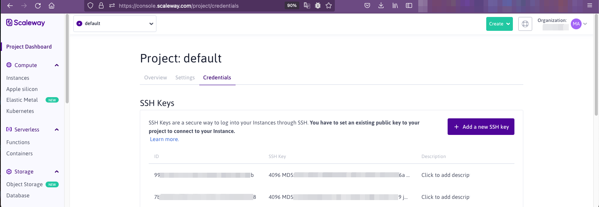
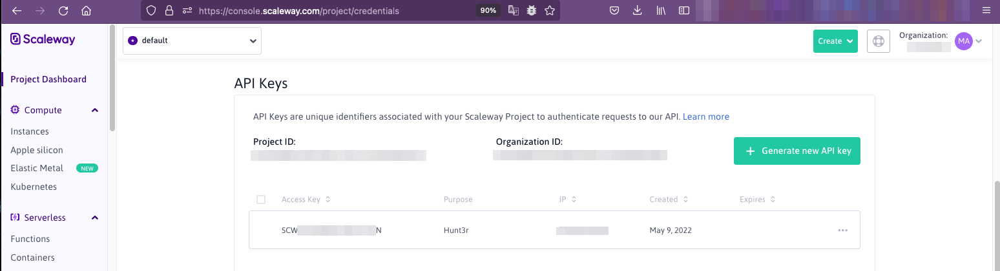

# First Setup

## Change your password

The first thing to do is to change your login information by going to your profile [/pages/user](http://0.0.0.0/pages/user)

## Configure a Cloud Provider

!!! warning "Cloud Provider Support"

    Version 1.0 comes with Scaleway support only at the moment, other cloud providers will be added in the following versions with AWS first

!!! info "SSH Key"

    An SSH key will be required by Hunt3r to deploy and manage your servers, however it is possible to configure a specific SSH key for Hunt3r and by provider

To be able to launch a scan you will first have to configure a Cloud Provider on the page [/admin/cloud/settings](http://0.0.0.0/admin/cloud/settings).

### Scaleway configuration

First of all it is necessary to add an SSH key on https://console.scaleway.com/project/credentials

As well as a Keys API for Hunt3r, still on the same page

