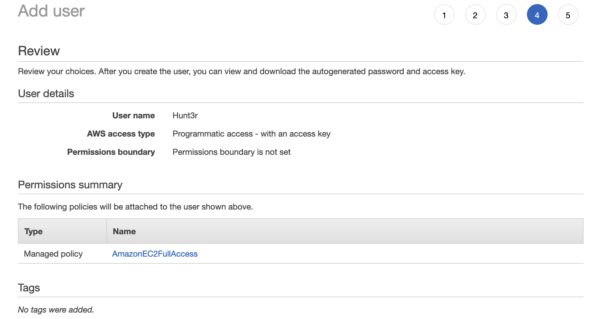
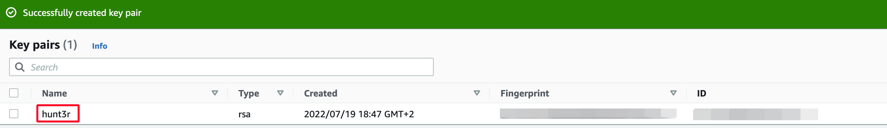
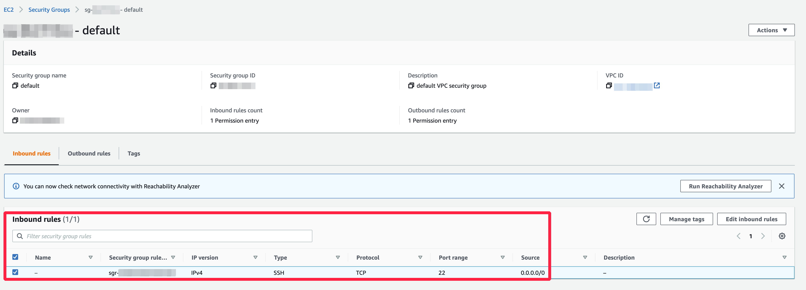

# First Setup

## Change your password

The first thing to do is to change your login information by going to your profile [/pages/user](http://0.0.0.0/pages/user)

## Configure a Cloud Provider

!!! info "SSH Key"

    An SSH key will be required by Hunt3r to deploy and manage your servers, however it is possible to configure a specific SSH key for Hunt3r and by provider

To be able to launch a scan you will first have to configure a Cloud Provider on the page [/admin/cloud/settings](http://0.0.0.0/admin/cloud/settings).

### Scaleway configuration

First of all it is necessary to add an SSH key on https://console.scaleway.com/project/credentials

As well as a Keys API for Hunt3r, still on the same page

### AWS configuration

You need to add a user [here](https://console.aws.amazon.com/iamv2/home#/users) with EC2 rights

You have to register your SSH key (without passphrase) [here](https://eu-west-1.console.aws.amazon.com/ec2/v2/home?region=eu-west-1#KeyPairs:) with the name 'hunt3r' (required), the key must be registered in the same region as the region used on the dashboard.

The default group security must be modified to allow SSH connections (Inbound rules) at least [here](https://eu-west-1.console.aws.amazon.com/ec2/v2/home?region=eu-west-1#SecurityGroups:)

### Nuclei configuration

If you want to use Nuclei, we advise you to use a custom configuration file to add template exclusions on [/admin/tools/settings](http://0.0.0.0/admin/tools/). In case no file is filled in, all templates will be used

If necessary, you can use our [suggested configuration](https://docs.hunt3r.ovh/assets/files/nuclei_config.yml)

### Amass configuration

The last step is to add your Amass configuration on [/admin/tools/settings](http://0.0.0.0/admin/tools/), it is indeed not possible to start a scan without putting a configuration file.
Since this tool is the heart of the recognition, we advise you to have as many API keys as possible.

See [How to Use Amass More Effectively for Bug Bounties](https://hakluke.medium.com/haklukes-guide-to-amass-how-to-use-amass-more-effectively-for-bug-bounties-7c37570b83f7)

The default configuration file can be found [here](https://github.com/OWASP/Amass/blob/master/examples/config.ini).

